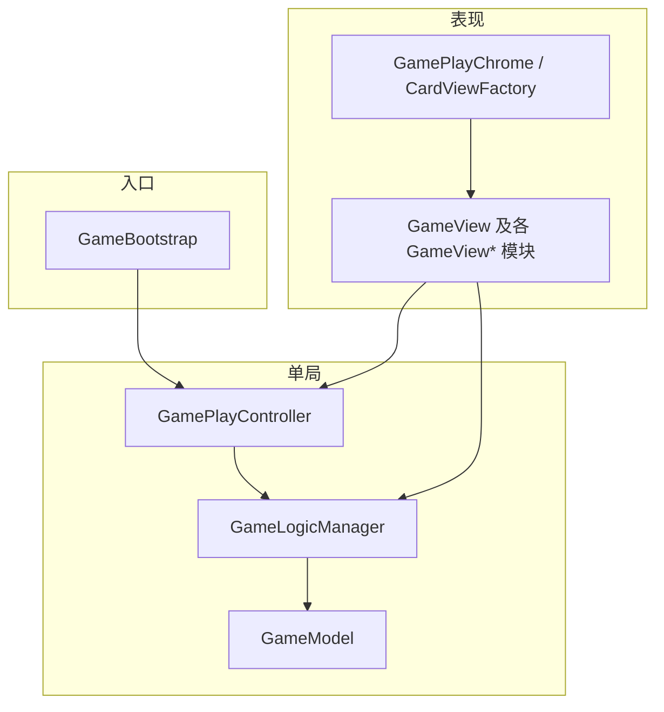
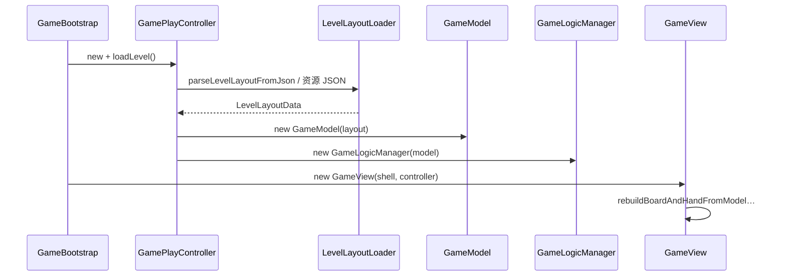

# Card Crash 程序设计文档（扩展与交付）

| 项目 | 说明 |
|------|------|
| **引擎** | Cocos Creator 3.8.x（以工程 `package.json` 为准） |
| **版本** | 与仓库 `assets/Classes`、`assets/scripts` 当前结构一致 |
| **读者** | 接手开发、代码评审、策划（JSON/资源路径）、测试（回归范围） |
| **维护** | 架构或规则变更时同步更新 **第 4.3 节 对照表**、**第 7 节**、**第 12 节** |

<a id="delivery-highlights"></a>

## 交付亮点（项目差异化与展示价值）

本节面向**交付评审、版本发布说明与接手团队**：用最少时间理解「这款产品与技术栈值得投入在哪里」。细节仍以正文各章为准。

### 产品与玩法

- **接牌规则清晰、易传达**：列顶与手顶 **点数 rank 相邻（差为 1）** 即可接牌，**不看花色**，学习成本低、适合休闲向传播与录屏演示。
- **完整单局闭环**：选关 → 异步加载布局 → 对局（吃列 / 抽盖牌 / 道具）→ 超时或胜利结算 → 回大厅；**进度、金币解锁、星级**等与 `PlayerProgressService` 等模块衔接，具备商用雏形。
- **操作手感**：吃牌 **直线飞入手顶**、抽牌与撤销 **弧线飞牌**；撤销时在数据栈与表现层 **成套对称**（见第 3–4 节），避免「能玩不能撤」的割裂体验。
- **关卡管线双格式**：支持既有 **hand + board.columns** JSON，以及策划向 **Playfield + Stack（V1）** 布局（`LevelLayoutLoader` 分发、`LevelLayoutAuthoringV1` 解析），便于关卡量产与工具链扩展。

### 技术与架构

- **分层干净，扩展有章可循**：`GameModel`（桌数据）← `GameLogicManager`（合法步进 + 撤销栈）← `GameView`（纯表现与输入），视图 **不直接改列/堆/手顶**；新增操作遵循 **`try*` + 成功前 `_pushSnapshot`**，文档 **第 2、4 节** 给出清单与对照表。
- **视图按职责拆模块**：对局相关 **`GameViewBoardRefresh` / `FlightOps` / `UndoFlight` / `Hud` / `PropRuntime`** 等 **文件** 边界清晰，**单文件职责与维护入口** 见第 9 节矩阵——利于多人协作与后续换皮。
- **引擎与分辨率策略明确**：设计分辨率 **1080×2080**、**固定宽度适配**（`ResolutionPolicy.FIXED_WIDTH` 与工程 `DesignLayout` 常量对齐），主牌区 / 堆牌区比例在配置层可追溯；盖牌行 **按可用屏宽动态压缩步长**（`computeStockRowMaxCenterSpan`），减少「底牌一行挤出屏幕」的低端机问题。
- **Creator 3.x 实战加固**：通过 **`CcEngineComponent`（字符串类名 `getComponent` / `addComponent`）** 与 **引擎枚举数值常量** 规避首包/循环依赖导致的 **`Type must be non-nil`、`.Type` 未定义** 等典型坑（第 11 节亦含资源与路径类排查）。

### 文档与交付物

- **可运维**：关键路径 **时序图（Mermaid）**、**回退对照表**、**经济—撤销耦合** 单独成节；**关键文件索引** 按入口 / 模型 / 视图分组（第 5 节），便于测试写用例与外包改需求时快速定位。
- **可回归**：附录给出 **`UndoAnimKind`、推断直觉、`Card` 形状** 与 **推荐手测用例**（第 12 节），支撑版本迭代 Smoke。

---

**导读**：本文在 **第 2 节** 说明「新增卡牌」的 **A/B/C** 三种场景与操作清单；在 **第 4 节** 说明「回退」的 **数据层** 与 **飞牌表现层**，并给 **文件修改顺序** 与 **示例**。**第 1.1–1.3 节** 补充目录与时序；**第 7–11 节** 补充关卡格式、控制器 API、视图矩阵、经济与撤销耦合与踩坑；**第 12 节** 为附录摘录。

---

## 目录

0. [交付亮点（项目差异化与展示价值）](#delivery-highlights)  
1. [架构总览](#1-架构总览)  
   1.1 [源码目录树](#11-源码目录树按职责)  
   1.2 [核心对象与数据约定](#12-核心对象与数据约定)  
   1.3 [单局关键时序](#13-单局关键时序)  
2. [如何新增一张 / 一类卡牌](#2-如何新增一张--一类卡牌按场景照做)  
3. [回退（撤销）机制现状](#3-回退撤销机制现状)  
4. [如何新增一种「回退类型」](#4-如何新增一种回退类型写清楚从按钮到模型)  
5. [关键文件索引（全量分组）](#5-关键文件索引全量分组)  
6. [小结](#6-小结)  
7. [关卡 JSON、索引与 resources 路径](#7-关卡-json索引与-resources-路径)  
8. [GamePlayController 要点](#8-gameplaycontroller-要点)  
9. [GameView 相关模块职责矩阵](#9-gameview-相关模块职责矩阵)  
10. [经济、奖励与撤销的耦合点](#10-经济奖励与撤销的耦合点)  
11. [常见问题与排查](#11-常见问题与排查)  
12. [附录](#12-附录)

---

## 1. 架构总览

对局采用「**单例局内模型 `GameModel` + `GameLogicManager` + 无状态服务 + 纯视图**」分离：**禁止**视图直接改 `columns`/`stock`/`handTop`，一律经 `GameLogicManager.try*` 或 `GameModel` 的 `apply*`（由逻辑层调用）。



| 层次 | 典型路径 | 职责 |
|------|-----------|------|
| 场景入口 | `assets/scripts/GameBootstrap.ts` | 壳节点、选关 ↔ 对局、预加载、`canvas-resize` |
| 控制器 | `assets/Classes/controllers/GamePlayController.ts` | `loadLevel`、持有 `model`/`logic`、超时/胜利/回菜单 |
| 玩法与撤销 | `assets/Classes/managers/GameLogicManager.ts` | `can*`、`try*`、`_pushSnapshot`、`inferUndoAnimation` |
| 数据模型 | `assets/Classes/models/GameModel.ts` | 手顶、备用堆、列；`clone`/`assignFrom`/`toPlain` |
| 关卡数据 | `assets/Classes/configs/LevelLayoutLoader.ts`、`LevelTypes.ts` | JSON → `LevelLayoutData`、发牌/翻面策略 |
| 规则 | `assets/Classes/services/MatchRuleService.ts` | 列顶与手顶 **rank 差的绝对值 = 1** 可接，**无花色** |
| 牌 | `assets/Classes/utils/CardEnums.ts` | `Card`、`cardKey`、花色解析、标准牌墙 |
| 视图 | `assets/Classes/views/*.ts` | 节点、飞牌、撤销飞牌、HUD、选关等 |

**原则**：凡改变 `GameModel` 的合法操作，须在 `GameLogicManager` 提供 `tryXxx`：**成功改状态前** `_pushSnapshot()`；**失败不得压栈**。

### 1.1 源码目录树（按职责）

```
assets/
├── scripts/
│   └── GameBootstrap.ts          # 场景挂载入口（与编辑器脚本 UUID 绑定）
├── resources/                     # 运行时 load 的资源（含关卡 JSON、牌图）
│   └── Data/level/               # level_*.json、level_index.json
└── Classes/
    ├── controllers/              # GamePlayController
    ├── managers/                 # GameLogicManager
    ├── models/                   # GameModel、PlayerProgressModel
    ├── configs/                  # 关卡/经济/UI/设计发牌常量
    ├── services/                 # 规则、进度、解锁、星级、奖励等
    ├── utils/                    # CardEnums、JuiceTweens、LabelReadability…
    └── views/                    # 对局/选关/UI 工厂（按功能拆多文件）
```

### 1.2 核心对象与数据约定

| 名称 | 位置 | 说明 |
|------|------|------|
| `Card` | `CardEnums.ts` | `{ rank: 1–13, suit: 0–3, faceUp: boolean }`；JSON 里 `suit` 为 `C/D/H/S` 经 `parseSuitLetter` 转换 |
| `GameModel` | `GameModel.ts` | `_handTop` 手牌区**顶部一张**（可见）；`_stock` 备用堆，**数组末尾 = 堆顶**（抽牌 `pop`）；`_columns[col]` **最后一个元素 = 列顶** |
| `GameModelPlain` | `GameModel.ts` | 可 JSON 序列化的快照；**不含**撤销栈 |
| `LevelLayoutData` | `LevelTypes.ts` | `id, matchRankMaxDiff, handTop, stock, columns`；`matchRankMaxDiff` 与 JSON `meta.wildLimit` 同步写入存档，**当前接牌规则不读此字段**（固定相邻 rank） |
| `UndoAnimKind` | `GameLogicManager.ts` | `'draw' \| 'play' & { col }`；扩展回退飞牌时需增分支 |

**坐标与层**：对局 shell 下节点坐标为根局部坐标；飞牌常在根上挂临时节点，再 `refreshFromModel` 销毁重建桌面子树。

### 1.3 单局关键时序

**进入对局（简化）**



**点击列顶（可接时）**

1. `GameViewBoardRefresh` 绑定列顶按钮 → `onColumnTap` → `GameViewFlightOps.runColumnFlyToHand`  
2. 动画：**直线** `tweenCardFlyLinear` 到手顶锚点；结束后再 `logic.tryPlayColumn(col)`（避免动画中途状态不一致）  
3. `tryPlayColumn`：`pushSnapshot` → `model.applyPlayColumn`（列顶变新 `_handTop`，下列翻面，**原手顶从模型移除**）  
4. `refreshFromModel` 重建 UI；可选金币/连击由 `GameplayRewardService`、`PlayerProgressService` 处理  

**点击「回退」**

1. `GamePlayChrome` → `GameView._onUndo` → `GameViewFlightOps.onUndo`  
2. `peekUndoSnapshot`；`inferUndoAnimation(cur, snap)`；有终点则弧线飞手顶到列/堆，结束 `applyUndoModel`；否则直接 `applyUndoModel`  
3. `applyUndoModel`：`popUndoAndRestore`，若 meta 为 `play` 可能 **扣回** 本局吃牌奖励金币  

---

## 2. 如何新增一张 / 一类「卡牌」（按场景照做）

先判断场景；**严禁**在不明白场景时同时改 JSON 和扩展 `Card` 结构。

| 你的目标 | 要不要改 TypeScript | 主要改动 |
|----------|---------------------|----------|
| 某关里出现某张 **标准 52 张**（换布局） | **否** | 关卡 JSON + `level_index.json` |
| **新花色 / 新点数**（仍是普通牌） | **是** | `CardEnums` → 资源 → `CardViewFactory`；（+）发牌链 |
| **新牌种**（万能、技能等） | **是** | `Card` 字段 + `GameModel` 全拷贝链 + 规则 + 加载器 + UI + §4 |

### 2.1 场景 A：只在某一关里换一张标准牌（零代码）

**步骤**：

1. 编辑 `assets/resources/Data/level/level_XXX.json`（或新建）。  
2. 在 `hand.initialTop` 或 `board.columns[i].stack` 写入：`rank`（number）、`suit`（`"C"|"D"|"H"|"S"`）、`faceUp`（boolean）。  
3. 全桌卡牌 **唯一**：`cardKey = "${rank}:${suit内部值}"`，重复则 `LevelLayoutLoader` 报错。  
4. 新关在 `assets/resources/Data/level/level_index.json` 增加 `levels[]` 项；`file` 为相对 resources 的路径（可带或不带 `.json`，见 `layoutResourcePathFromIndexFile`）。

**单牌示例**：

```json
{ "rank": 3, "suit": "D", "faceUp": true }
```

### 2.2 场景 B：扩展花色或点数

**顺序**：`CardEnums.ts`（解析、标签、红黑色、`createStandardDeckFaceDown`）→ `LevelLayoutLoader.parseCard`（若字母表变化）→ `resources/images/number/*`、`images/suits/*` → `CardViewFactory._suitImageName` / `_addCardArtwork`。  

若牌墙 **≠ 52**，必须重审 `LevelLayoutLoader` 随机发牌、`DesignLayout.dealTotalCardsForLevel`、`uniquePlacedSet`。

### 2.3 场景 C：新牌种（全链路）

1. **`CardEnums.ts`**：扩展 `Card` 或平行结构。  
2. **`GameModel.ts`**：**所有** `clone` / `assignFrom` / `toPlain` / `fromPlain` / `resetFromLayout` 中对 `Card` 的浅拷贝须含新字段。  
3. **`MatchRuleService` / `GameLogicManager.canPlayColumn`**：新规则。  
4. **`LevelLayoutLoader` + `LevelTypes`**：JSON 字段。  
5. **`CardViewFactory`**：表现。  
6. 若有新 `tryXxx`：见 **§4**（`_pushSnapshot` + 可选 `UndoAnimKind`）。

---

## 3. 回退（撤销）机制现状

### 3.1 数据层

- 栈：`GameLogicManager` 的 `_past: GameModel[]`，元素为 **`clone()` 的完整桌**。  
- **压栈时机**：在 **`tryPlayColumn`、`tryDrawStock`、`tryRevealFirstFaceDownTop`、`tryShuffleStock`** 成功修改模型 **之前**（`_pushSnapshot`）。  
- **弹出**：`popUndoAndRestore()` → `assignFrom` 栈顶快照。  
- **整局重来**：`resetToInitial()` 清空栈并恢复进入关时的 `GameModel` 拷贝（与单步撤销无关）。

### 3.2 视图层

`onUndo`：`inferUndoAnimation` 仅精确定位 **`draw` / `play`**；其它操作返回 `null` 时 **无飞牌**，直接数据回滚。  
撤销 **吃列** 时 `applyUndoModel` 可能根据 `GameplayRewardService` **扣回** 吃牌金币。

---

## 4. 如何新增一种「回退类型」（从按钮到模型）

### 两层含义

| 路线 | 含义 | 最低工作 |
|------|------|----------|
| **A. 数据** | 栈恢复到上一 `GameModel` | `tryXxx` 内 `_pushSnapshot()` + 改模型 |
| **B. 表现** | 回退时飞牌落点与上一手对称 | 扩展 `UndoAnimKind` + `inferUndoAnimation` + `resolveUndoFlightEndLocal` + 必要时改 `flyUndoCardArcThenApply` / `applyUndoModel` |

### 调用链（排错时从左查到右）

1. `GamePlayChrome`「回退」→ `GameView._onUndo()` → `GameViewFlightOps.onUndo(rt)`  
2. `logic.peekUndoSnapshot()`；`GameLogicManager.inferUndoAnimation(cur, snap)`  
3. `resolveUndoFlightEndLocal(meta, …)` → `Vec3 | null`  
4. 有终点：`flyUndoCardArcThenApply` → 回调里 `applyUndoModel`；无终点：直接 `applyUndoModel`  
5. `applyUndoModel`：`popUndoAndRestore`、`refreshFromModel`、按 `meta.type` 处理金币等  

### 4.1 必做（路线 A）

- `GameModel.applyXxx`（或私有设值封装）  
- `GameLogicManager.canXxx` / `tryXxx`，且 **`tryXxx` 成功路径：先 `_pushSnapshot` 再改模型**  

### 4.2 选做（路线 B）

| 顺序 | 文件 | 内容 |
|------|------|------|
| 1 | `GameLogicManager.ts` | 扩展 `UndoAnimKind`；**保持** `infer` 里 `play`/`draw` **判定顺序在前** |
| 2 | `GameViewUndoFlight.ts` | `resolveUndoFlightEndLocal` 对新 `meta` 返回根局部坐标 |
| 3 | `GameViewFlightOps.ts` | `flyUndoCardArcThenApply` 中 `makeCardNode` 的数据源；`applyUndoModel` 中副作用 |

**冲突**：两种操作结果盘面不可区分时，需 `GameModel` 增加「上一 opcode」或栈存元组（评审）。

### 4.3 与现有操作对照

| 逻辑入口 | `_pushSnapshot` | `inferUndoAnimation` 飞牌 |
|----------|-----------------|---------------------------|
| `tryPlayColumn` | 是 | 支持 `play` |
| `tryDrawStock` | 是 | 支持 `draw` |
| `tryRevealFirstFaceDownTop` | 是 | `null`（无飞牌） |
| `tryShuffleStock` | 是 | `null` |

### 4.4 「亮顶」飞牌回退（示意）

1. `UndoAnimKind` += `{ type: 'reveal'; col: number }`  
2. `infer`：排除 `play`/`draw` 后，唯一列满足「`snap` 顶暗、`cur` 顶同点花色但亮、列长不变」→ `reveal`  
3. `resolveUndoFlightEndLocal`：`columnCardRootLocal(col, len-1)`  
4. `flyUndoCardArcThenApply`：flyer 用 **当前列顶牌面**  
5. `applyUndoModel`：按需求补金币分支  

### 4.5 校验清单

- [ ] 失败不压栈；成功先压栈再改模型  
- [ ] `clone`/`assignFrom`/存档字段完整  
- [ ] `infer` 不误判 `play`/`draw`  
- [ ] 新类型飞牌终点非 `null`（若承诺有动画）  
- [ ] 执行与撤销的经济对称  
- [ ] `onUndo` 守卫：暂停、超时、`getFlyAnimating`  

---

## 5. 关键文件索引（全量分组）

**入口与控制器**

| 文件 | 说明 |
|------|------|
| `assets/scripts/GameBootstrap.ts` | 选关/对局 shell、预加载 |
| `assets/Classes/controllers/GamePlayController.ts` | 加载关卡、model/logic、结算 |

**模型、规则、关卡**

| 文件 | 说明 |
|------|------|
| `assets/Classes/models/GameModel.ts` | 桌数据 |
| `assets/Classes/models/PlayerProgressModel.ts` | 持久化进度结构 |
| `assets/Classes/managers/GameLogicManager.ts` | 步进与撤销栈 |
| `assets/Classes/services/MatchRuleService.ts` | 相邻 rank 匹配 |
| `assets/Classes/configs/LevelLayoutLoader.ts` | JSON 解析与发牌 |
| `assets/Classes/configs/LevelTypes.ts` | DTO |
| `assets/Classes/configs/LevelCatalog.ts` | 资源路径与 `loadJsonFromResources` |
| `assets/Classes/configs/LevelIndexLoader.ts` | `level_index` 解析 |
| `assets/Classes/configs/DesignLayout.ts` | 发牌张数等设计常量 |
| `assets/Classes/utils/CardEnums.ts` | 牌定义 |

**对局视图（主要）**

| 文件 | 说明 |
|------|------|
| `assets/Classes/views/GameView.ts` | 对局根视图、/chrome 组装 |
| `assets/Classes/views/GamePlayChrome.ts` | 底栏按钮、绑定回调 |
| `assets/Classes/views/CardViewFactory.ts` | 牌节点 |
| `assets/Classes/views/GameViewBoardRefresh.ts` | 列/手/堆重建 |
| `assets/Classes/views/GameViewBoardLayout.ts` | 布局度量 |
| `assets/Classes/views/GameViewFlightOps.ts` | 列点击、抽牌、撤销飞牌 |
| `assets/Classes/views/GameViewUndoFlight.ts` | 撤销终点解算 |
| `assets/Classes/utils/JuiceTweens.ts` | 飞牌 tween |
| `assets/Classes/views/GameViewHudPauseBridge.ts` | HUD、计时、暂停 |
| `assets/Classes/views/GameViewPropRuntime.ts` | 道具触发 **→ logic.try*** |

**选关与其它**

| 文件 | 说明 |
|------|------|
| `assets/Classes/views/LevelSelectView.ts` | 选关 |
| `assets/Classes/views/LevelSelectChrome.ts` 等 | 选关 UI |
| `assets/Classes/services/PlayerProgressService.ts` | 金币/解锁等 API |

（其余 `GameView*.ts`、弹窗、商店等见 §9。）

---

## 6. 小结

- **卡牌**：A 只 JSON；B 枚举+资源+工厂；C 全链路与 §4。  
- **回退**：数据 = 压栈 + `tryXxx`；飞牌 = `UndoAnimKind` + `infer` + `resolve` + 可选 `fly`/`applyUndoModel`。  

---

## 7. 关卡 JSON、索引与 resources 路径

### 7.1 路径约定

- **resources 根**：Cocos 工程的 `assets/resources/`。  
- **加载**：`resources.load('Data/level/level_001', JsonAsset)` — **无 `.json` 后缀**（与 `LevelCatalog.loadJsonFromResources` 一致）。  
- **索引项 `file`**：如 `Data/level/level_001.json`，会经 `layoutResourcePathFromIndexFile` 去掉扩展名再 load。

### 7.2 关卡 JSON 常见字段（示例骨架）

以下为 **示意骨架**；实际文件可能由加载器合并随机发牌结果（含 `stock`），以 `LevelLayoutLoader` 与运行时 `LevelLayoutData` 为准。

```json
{
  "id": 1,
  "meta": { "undoLimit": 2, "wildLimit": 3 },
  "hand": {
    "initialTop": { "rank": 4, "suit": "C", "faceUp": true }
  },
  "board": {
    "columns": [
      { "stack": [ { "rank": 8, "suit": "C", "faceUp": false } ] }
    ]
  }
}
```

- **`meta.wildLimit`**：写入 `matchRankMaxDiff` 存档字段；**当前匹配规则不使用**（固定 rank 差为 1）。  
- **`meta.undoLimit`**：存在于各关 JSON，**当前工程内 TypeScript 未引用**（可视为策划预留或将来限制撤销步数）；上线功能前请 `grep undoLimit` 确认是否已实现。  
- **列顺序**：`board.columns[]` 下标与代码 `col` **一致**；每列 `stack[0]` 为 **列底**，`stack[length-1]` 为 **列顶**。

### 7.3 `level_index.json`

- 由 `parseLevelIndexFromJson` 解析；**无效条目会使整个索引解析失败**（严格校验）。  
- 每项需 **正整数 `id`**、非空 **`file`** 等（见加载器）。

---

## 8. GamePlayController 要点

| 成员 / 方法 | 说明 |
|-------------|------|
| `loadLevel()` | 异步；失败走错误 UI；成功则 `new GameModel`、`new GameLogicManager` |
| `get model` / `get logic` | **仅** `isReady === true` 后安全 |
| `levelId`、`layoutPath` | 注入值，整局不变 |
| `tryMarkWin`、`timedOut`、`winDispatched` | 结算与互斥 |
| `resetToLevelStart` | 通常配合模型 `resetFromLayout` + 逻辑 `resetToInitial`（以控制器实现为准） |

视图 **`GameView`** 构造时要求 **controller 已 `loadLevel` 成功**。

---

## 9. GameView 相关模块职责矩阵

| 模块 | 职责边界 |
|------|----------|
| `GameView.ts` | 组装 chrome、HUD、挂载 `FlightOps`/`PropRuntime`；生命周期与 `canvas-resize` |
| `GamePlayChrome.ts` | 菜单、回退、重开等按钮及坐标 |
| `GameViewBoardRefresh.ts` | 根据 `GameModel` 创建/更新列与手顶节点；绑定点击 |
| `GameViewBoardLayout.ts` | 区域高度、列间距、M 形偏移等 |
| `GameViewFlightOps.ts` | 吃牌直线飞、抽牌弧、撤销飞、**动画后再 `try*`** |
| `GameViewPropRuntime.ts` | 提示/亮顶/洗牌等 → 调 `logic` |
| `GameViewHudPauseBridge.ts` | 顶栏、倒计时、暂停层 |
| `GameViewMatchJuice.ts` 等 | 吃牌音效级反馈（非规则） |

---

## 10. 经济、奖励与撤销的耦合点

| 行为 | 触发 | 撤销时 |
|------|------|--------|
| 吃列成功 | `runColumnFlyToHand` 末尾 `PlayerProgressService.addCoins`（若 `GameplayRewardService.shouldAwardMatchCoins`） | `applyUndoModel` 中 **`meta.type === 'play'`** 时 `addCoins(-kCoinsPerSuccessfulMatch)` |
| 其它道具/商店 | `PropShopPanel`、`PlayerProgressService` | **不在** `applyUndoModel` 内；若未来步进改持久化，需单独设计是否入栈 |

**原则**：只有「本步操作立即改金币且与桌步绑定」的，才应在撤销时对称处理；否则容易漏撤或双重扣款。

---

## 11. 常见问题与排查

1. **能吃/不能吃与预期不符**  
   - 查 `MatchRuleService`：**必须** `|boardRank - handRank| === 1`；列顶须 `faceUp === true`。  

2. **撤销后桌态对但飞牌位置错**  
   - 查 `inferUndoAnimation` 是否把 `play` 错成 `draw` 或 `col` 错列。  

3. **撤销后金币不对**  
   - 查 `applyUndoModel` 的 `play` 分支与吃牌时是否 `shouldAwardMatchCoins` 一致。  

4. **新操作能玩不能撤**  
   - 查是否 **未** `_pushSnapshot` 或失败分支误压栈。  

5. **改 `Card` 后撤销丢字段**  
   - 全局搜 `clone(`、`assignFrom`、`toPlain`、`fromPlain`、`{ ...c }`。  

6. **资源路径 load 失败**  
   - 确认无多余 `.json`；路径相对 `resources`。  

---

## 12. 附录

### 12.1 `UndoAnimKind`（当前）

定义于 `assets/Classes/managers/GameLogicManager.ts`：

```ts
export type UndoAnimKind = { type: 'draw' } | { type: 'play'; col: number };
```

扩展时使用 **字面量判别** `meta.type`（避免字符串魔法值散落）。

### 12.2 `inferUndoAnimation` 判定直觉（文字版）

对 `current`（当前桌）与 `snapshotPrev`（回退目标）：

1. **若某列** `snapshotPrev` 比 `current` **多一张**：上一手为在该列 **吃牌**，`play` 且 `col` = 该列。  
2. **否则** 若 `stock` 长度 **`snapshotPrev === current + 1`**：上一手 **抽牌**，`draw`。  
3. **否则** 若 `stock` 长度相同但 **手顶 rank/suit** 变化且 **各列长度不变**：仍判 **抽牌**（循环翻牌规则）。  
4. **否则** 返回 `null`（无飞牌推断）。  

（以源码为准，此处便于读文档不传参。）

### 12.3 `Card`（逻辑层）

`assets/Classes/utils/CardEnums.ts`：

```ts
export interface Card {
    rank: number;
    suit: number;
    faceUp: boolean;
}
```

### 12.4 推荐回归用例（接牌 + 撤销）

1. 手顶 4、列顶 3 → 可接；接后手顶 3。  
2. 手顶 4、列顶 5 → 可接。  
3. 手顶 4、列顶 4 → **不可**接。  
4. 接后点撤销 → 桌态与手顶恢复；若本关有吃牌金币则金币回退。  

